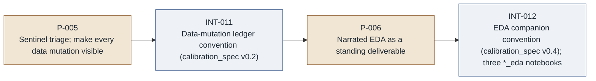

# Interaction ledger

*Generated by `meta/tools/render_ledger.py` from `meta/logs/ledger.yaml`; do not edit by hand. Each chain links existing records (prompts P, interventions INT, decisions A/B/C/D) in the order they happened, from the business question to the published finding. Human steps are shaded in the diagrams.*

## Open items

| Record | Kind | Status | Since | Owner | Where the ask is | Note |
| --- | --- | --- | --- | --- | --- | --- |
| [D14](https://github.com/JordanBeary/tributary/blob/main/meta/logs/decisions.md) | action | scheduled | 2026-09-02 | human | [`meta/logs/sessions/2026-09-01_decision_requests.md`](https://github.com/JordanBeary/tributary/blob/main/meta/logs/sessions/2026-09-01_decision_requests.md) | Publishing flips to on-push (Q-J, answered): a workflow-trigger commit made after the reframed site deploys and the human has read it. Nothing else is open from the packet. |
| [INT-017](https://github.com/JordanBeary/tributary/blob/main/meta/logs/interventions.md) | intervention | open-until-deploy | 2026-09-01 | agent | [`meta/logs/sessions/2026-09-01_reframe_session.md`](https://github.com/JordanBeary/tributary/blob/main/meta/logs/sessions/2026-09-01_reframe_session.md) | Closes when the reframed site deploys; the next Global session records the deployment |
| [INT-018](https://github.com/JordanBeary/tributary/blob/main/meta/logs/interventions.md) | intervention | in-progress | 2026-09-02 | agent | [`meta/logs/sessions/2026-09-01_decision_requests.md`](https://github.com/JordanBeary/tributary/blob/main/meta/logs/sessions/2026-09-01_decision_requests.md) | Business-problem framing being written into the four model cards and the models page (Local unit) |
| [Q4](https://github.com/JordanBeary/tributary/blob/main/meta/logs/decisions.md) | question | open | 2026-08-03 | human | [`meta/logs/decisions.md`](https://github.com/JordanBeary/tributary/blob/main/meta/logs/decisions.md) | Whether to demonstrate a PR-based workflow; parked, non-blocking |

## Resolved

| Record | Resolved | Disposition |
| --- | --- | --- |
| [D11](https://github.com/JordanBeary/tributary/blob/main/meta/logs/decisions.md) | 2026-09-02 | Ratified as recorded (packet Q-A), with the INT-018 framing direction attached; Phase 5 closes |
| [D14](https://github.com/JordanBeary/tributary/blob/main/meta/logs/decisions.md) | 2026-09-02 | Ratified (Q-B); INT-017 classified ambiguity; conventions Section 3 amended under it (Q-G) |
| [D15](https://github.com/JordanBeary/tributary/blob/main/meta/logs/decisions.md) | 2026-09-02 | Ratified (Q-C): path, PDF 404 with stub, git-ignored private notes, parent outside the harness |
| [D16](https://github.com/JordanBeary/tributary/blob/main/meta/logs/decisions.md) | 2026-09-02 | Confirmed with the id allocation (Q-K) |
| [D17](https://github.com/JordanBeary/tributary/blob/main/meta/logs/decisions.md) | 2026-09-02 | Ratified option 1 (Q-F): the generated table satisfies the charter's ledger clause; its check semantics were fixed 2026-09-03 (INT-019) and the CI wiring stays proposed |
| [D18](https://github.com/JordanBeary/tributary/blob/main/meta/logs/decisions.md) | 2026-09-02 | Ratified (Q-I): the five-seed band is the Phase 6 exit measurement |
| [C1](https://github.com/JordanBeary/tributary/blob/main/meta/logs/decisions.md) | 2026-09-02 | Closed (Q-E): the declared price scale stands; the memo's price-scale caveat is the honest statement |
| [P-013](https://github.com/JordanBeary/tributary/blob/main/meta/logs/prompts.md) | 2026-09-02 | Accepted into the prompt log (Q-G); the 2026-09-01 direction stays a decision-cited quotation |
| [D12](https://github.com/JordanBeary/tributary/blob/main/meta/logs/decisions.md) | 2026-09-02 | Superseded on the publishing condition by D14 (Q-J); every other part stands |

## Identity and duplicate spend

**Question.** How many distinct consumers do we actually have, and what does buying the same consumer twice cost?

**Finding.** 2.40M lead ids resolve to 635,579 consumers (3.8x overcount); after buyer-side recency suppression, $12.0M (5.7% of revenue) is still paid for consumers bought within the prior 30 days. Sources: [`analysis/dashboards/data/04_identity.json`](https://github.com/JordanBeary/tributary/blob/main/analysis/dashboards/data/04_identity.json), [`docs/silo_audit.md`](https://github.com/JordanBeary/tributary/blob/main/docs/silo_audit.md).

```mermaid
flowchart LR
  s1["P-002<br/>Seed: 'impose/add unifying keys' on simulated data"]
  s2["docs/design.md<br/>Hidden-crosswalk scoring mechanism (design 2.4; jointly attributed)"]
  s3["C13<br/>Consumer engine: record grain, synthetic identities, derived FICO band"]
  s4["P-007<br/>Ratified with domain confirmation (1:many borrowers); term amended to 'synthetic data'"]
  s5["C14<br/>Applications-per-consumer mix corrected on paper (mean 1.32 -> 1.60)"]
  s6["D8<br/>First ER run too clean: link F1 0.976, dedupe 0.997; recommends turning dials up"]
  s7["P-010<br/>Amended: author's leads-per-contact table, channel-dependent drift, band moved to 0.8-0.9"]
  s8["C18<br/>Engine amendment; first run lands link F1 0.879, dedupe 0.873"]
  s9["D9<br/>Clusters at the 0.9998-precision operating point; deterministic auction linkage"]
  s10["er/scorecard.json<br/>Scorecard against the hidden crosswalk (C19 run)"]
  s11["D10<br/>dim_consumer: 3.8x overcount; $40.0M same-buyer-30d duplicate revenue, unpenalized"]
  s12["P-011<br/>'These two items are troublesome'; duplicate-performance KPI table supplied"]
  s13["C19<br/>Buyer-side recency penalties fitted to the table; redeployed end to end"]
  s14["analysis/dashboards/data/04_identity.json<br/>Published: 635,579 consumers; $12.0M residual duplicate spend (5.7%)"]
  s1 --> s2
  s2 --> s3
  s3 --> s4
  s4 --> s5
  s5 --> s6
  s6 --> s7
  s7 --> s8
  s8 --> s9
  s9 --> s10
  s10 --> s11
  s11 --> s12
  s12 --> s13
  s13 --> s14
  classDef human fill:#f1e6d4,stroke:#8a5a2b,color:#1f2933;
  classDef agent fill:#eef2f7,stroke:#3b5b8c,color:#1f2933;
  classDef harness fill:#ffffff,stroke:#7b8794,color:#1f2933,stroke-dasharray:4 2;
  class s1,s4,s7,s12 human;
  class s2,s3,s5,s6,s8,s9,s10,s11,s13 agent;
  class s14 harness;
```

| # | Actor | Kind | Record | Date | What happened |
| --- | --- | --- | --- | --- | --- |
| 1 | human | prompt | [P-002](https://github.com/JordanBeary/tributary/blob/main/meta/logs/prompts.md) | 2026-07 | Seed: 'impose/add unifying keys' on simulated data |
| 2 | agent | proposal | [`docs/design.md`](https://github.com/JordanBeary/tributary/blob/main/docs/design.md) | 2026-07 | Hidden-crosswalk scoring mechanism (design 2.4; jointly attributed) |
| 3 | agent | proposal | [C13](https://github.com/JordanBeary/tributary/blob/main/meta/logs/decisions.md) | 2026-08-07 | Consumer engine: record grain, synthetic identities, derived FICO band |
| 4 | human | decision | [P-007](https://github.com/JordanBeary/tributary/blob/main/meta/logs/prompts.md) | 2026-08-07 | Ratified with domain confirmation (1:many borrowers); term amended to 'synthetic data' |
| 5 | agent | correction | [C14](https://github.com/JordanBeary/tributary/blob/main/meta/logs/decisions.md) | 2026-08-07 | Applications-per-consumer mix corrected on paper (mean 1.32 -> 1.60) |
| 6 | agent | finding | [D8](https://github.com/JordanBeary/tributary/blob/main/meta/logs/decisions.md) | 2026-08-20 | First ER run too clean: link F1 0.976, dedupe 0.997; recommends turning dials up |
| 7 | human | decision | [P-010](https://github.com/JordanBeary/tributary/blob/main/meta/logs/prompts.md) | 2026-08-20 | Amended: author's leads-per-contact table, channel-dependent drift, band moved to 0.8-0.9 |
| 8 | agent | artifact | [C18](https://github.com/JordanBeary/tributary/blob/main/meta/logs/decisions.md) | 2026-08-20 | Engine amendment; first run lands link F1 0.879, dedupe 0.873 |
| 9 | agent | decision | [D9](https://github.com/JordanBeary/tributary/blob/main/meta/logs/decisions.md) | 2026-08-20 | Clusters at the 0.9998-precision operating point; deterministic auction linkage |
| 10 | agent | artifact | [`er/scorecard.json`](https://github.com/JordanBeary/tributary/blob/main/er/scorecard.json) | 2026-08-24 | Scorecard against the hidden crosswalk (C19 run) |
| 11 | agent | finding | [D10](https://github.com/JordanBeary/tributary/blob/main/meta/logs/decisions.md) | 2026-08-20 | dim_consumer: 3.8x overcount; $40.0M same-buyer-30d duplicate revenue, unpenalized |
| 12 | human | prompt | [P-011](https://github.com/JordanBeary/tributary/blob/main/meta/logs/prompts.md) | 2026-08-24 | 'These two items are troublesome'; duplicate-performance KPI table supplied |
| 13 | agent | artifact | [C19](https://github.com/JordanBeary/tributary/blob/main/meta/logs/decisions.md) | 2026-08-24 | Buyer-side recency penalties fitted to the table; redeployed end to end |
| 14 | harness | finding | [`analysis/dashboards/data/04_identity.json`](https://github.com/JordanBeary/tributary/blob/main/analysis/dashboards/data/04_identity.json) | 2026-08-24 | Published: 635,579 consumers; $12.0M residual duplicate spend (5.7%) |

## Marketing attribution

**Question.** Which acquisition channels earn their spend once revenue is joined through the auction?

**Finding.** 93% of $209.2M revenue is attributable to a marketing contact; paid ROAS runs 0.94x (display, below break-even) to 3.06x (affiliate). The unprofitable-channel answer changed twice as the author's domain inputs arrived. Sources: [`analysis/dashboards/data/05_attribution.json`](https://github.com/JordanBeary/tributary/blob/main/analysis/dashboards/data/05_attribution.json), [`docs/silo_audit.md`](https://github.com/JordanBeary/tributary/blob/main/docs/silo_audit.md).

```mermaid
flowchart LR
  s1["P-002<br/>Brief: organize, store, analyze; a marketing silo in scope"]
  s2["C5<br/>Message funnel rates declared (Criteo has no email funnel)"]
  s3["C15<br/>Contact pool with never-applier prospects; inverse construction; ITT"]
  s4["P-008<br/>'Where are these never-applier prospects coming from' — channel mix with realistic intent and KPIs"]
  s5["C16<br/>Seven-channel intent ladder, unit economics, monthly spend ledger; ROAS 0.78x-2.7x"]
  s6["D7<br/>Staging: marketing silo via local Parquet exports; naive-UTC convention"]
  s7["D10<br/>Attribution operating points: acquisition-cohort ROAS, 30-day last touch"]
  s8["D10<br/>Under C18 every paid channel clears break-even (display 1.29x); C16 table annotated, not rewritten"]
  s9["P-011<br/>Recency KPI table (same prompt as the identity chain)"]
  s10["C19<br/>Recency penalties weigh hardest on repeat-heavy low-intent channels"]
  s11["analysis/dashboards/data/05_attribution.json<br/>Published: display 0.94x, affiliate 3.06x; 93% of revenue attributed"]
  s1 --> s2
  s2 --> s3
  s3 --> s4
  s4 --> s5
  s5 --> s6
  s6 --> s7
  s7 --> s8
  s8 --> s9
  s9 --> s10
  s10 --> s11
  classDef human fill:#f1e6d4,stroke:#8a5a2b,color:#1f2933;
  classDef agent fill:#eef2f7,stroke:#3b5b8c,color:#1f2933;
  classDef harness fill:#ffffff,stroke:#7b8794,color:#1f2933,stroke-dasharray:4 2;
  class s1,s4,s9 human;
  class s2,s3,s5,s6,s7,s8,s10 agent;
  class s11 harness;
```

| # | Actor | Kind | Record | Date | What happened |
| --- | --- | --- | --- | --- | --- |
| 1 | human | prompt | [P-002](https://github.com/JordanBeary/tributary/blob/main/meta/logs/prompts.md) | 2026-07 | Brief: organize, store, analyze; a marketing silo in scope |
| 2 | agent | proposal | [C5](https://github.com/JordanBeary/tributary/blob/main/meta/logs/decisions.md) | 2026-07-31 | Message funnel rates declared (Criteo has no email funnel) |
| 3 | agent | proposal | [C15](https://github.com/JordanBeary/tributary/blob/main/meta/logs/decisions.md) | 2026-08-10 | Contact pool with never-applier prospects; inverse construction; ITT |
| 4 | human | prompt | [P-008](https://github.com/JordanBeary/tributary/blob/main/meta/logs/prompts.md) | 2026-08-10 | 'Where are these never-applier prospects coming from' — channel mix with realistic intent and KPIs |
| 5 | agent | artifact | [C16](https://github.com/JordanBeary/tributary/blob/main/meta/logs/decisions.md) | 2026-08-10 | Seven-channel intent ladder, unit economics, monthly spend ledger; ROAS 0.78x-2.7x |
| 6 | agent | decision | [D7](https://github.com/JordanBeary/tributary/blob/main/meta/logs/decisions.md) | 2026-08-20 | Staging: marketing silo via local Parquet exports; naive-UTC convention |
| 7 | agent | decision | [D10](https://github.com/JordanBeary/tributary/blob/main/meta/logs/decisions.md) | 2026-08-20 | Attribution operating points: acquisition-cohort ROAS, 30-day last touch |
| 8 | agent | finding | [D10](https://github.com/JordanBeary/tributary/blob/main/meta/logs/decisions.md) | 2026-08-20 | Under C18 every paid channel clears break-even (display 1.29x); C16 table annotated, not rewritten |
| 9 | human | prompt | [P-011](https://github.com/JordanBeary/tributary/blob/main/meta/logs/prompts.md) | 2026-08-24 | Recency KPI table (same prompt as the identity chain) |
| 10 | agent | artifact | [C19](https://github.com/JordanBeary/tributary/blob/main/meta/logs/decisions.md) | 2026-08-24 | Recency penalties weigh hardest on repeat-heavy low-intent channels |
| 11 | harness | finding | [`analysis/dashboards/data/05_attribution.json`](https://github.com/JordanBeary/tributary/blob/main/analysis/dashboards/data/05_attribution.json) | 2026-08-24 | Published: display 0.94x, affiliate 3.06x; 93% of revenue attributed |

## Funnel and auction economics

**Question.** What do leads sell for by tier and quality, and does a higher purchase price predict funding?

**Finding.** Funded rate falls from 14.3% (tier 1) to 8.5% (tier 6) once price carries a modest gradient; overall sell-through moved from the invented ~60% to the source data's 49%. The absolute price level (C1) remains an open watch item. Sources: [`analysis/dashboards/data/02_funnel.json`](https://github.com/JordanBeary/tributary/blob/main/analysis/dashboards/data/02_funnel.json), [`analysis/dashboards/data/03_auction.json`](https://github.com/JordanBeary/tributary/blob/main/analysis/dashboards/data/03_auction.json).

```mermaid
flowchart LR
  s1["C1<br/>Price scale invented ($2 to $120 anchor); agent asked for a gut-check that never entered the log"]
  s2["C2<br/>Sell-through ~60% declared"]
  s3["C9<br/>iPinYou elasticity -0.149 fitted; drafted as 'wrong-sign'"]
  s4["INT-013<br/>Reframed: valid in-domain estimate, non-transferable; empirical value preserved"]
  s5["INT-014<br/>New Spearman gate falsifies the +1.0 override the same day; omission recorded"]
  s6["C11<br/>Rank-q, elasticity 3.0, within-vertical sigma; human's sigma prediction recorded as not load-bearing"]
  s7["C12<br/>Cherry-picking participation from a gate-verified dose-response grid"]
  s8["C17<br/>Offer payload on bid requests; funded flag drawn uniformly among sold leads"]
  s9["P-009<br/>Ratified with the OLAP wide-fact rationale"]
  s10["D9<br/>Deterministic auction-CRM linkage recovers 99.8% of recoverable events"]
  s11["D10<br/>Funded rate flat by construction (C17d); flagged as a realism watch item"]
  s12["P-011<br/>'Higher purchase price should garner better results ... but the lift should be modest'"]
  s13["C19<br/>Price gradient on funded (beta 0.15, mean preserved); sell-through 60% -> 49%"]
  s14["analysis/dashboards/data/02_funnel.json<br/>Published: funded 14.3% (tier 1) to 8.5% (tier 6)"]
  s1 --> s2
  s2 --> s3
  s3 --> s4
  s4 --> s5
  s5 --> s6
  s6 --> s7
  s7 --> s8
  s8 --> s9
  s9 --> s10
  s10 --> s11
  s11 --> s12
  s12 --> s13
  s13 --> s14
  classDef human fill:#f1e6d4,stroke:#8a5a2b,color:#1f2933;
  classDef agent fill:#eef2f7,stroke:#3b5b8c,color:#1f2933;
  classDef harness fill:#ffffff,stroke:#7b8794,color:#1f2933,stroke-dasharray:4 2;
  class s4,s9,s12 human;
  class s1,s2,s3,s6,s7,s8,s10,s11,s13 agent;
  class s5,s14 harness;
```

| # | Actor | Kind | Record | Date | What happened |
| --- | --- | --- | --- | --- | --- |
| 1 | agent | proposal | [C1](https://github.com/JordanBeary/tributary/blob/main/meta/logs/decisions.md) | 2026-07-31 | Price scale invented ($2 to $120 anchor); agent asked for a gut-check that never entered the log |
| 2 | agent | proposal | [C2](https://github.com/JordanBeary/tributary/blob/main/meta/logs/decisions.md) | 2026-07-31 | Sell-through ~60% declared |
| 3 | agent | finding | [C9](https://github.com/JordanBeary/tributary/blob/main/meta/logs/decisions.md) | 2026-08-07 | iPinYou elasticity -0.149 fitted; drafted as 'wrong-sign' |
| 4 | human | correction | [INT-013](https://github.com/JordanBeary/tributary/blob/main/meta/logs/interventions.md) | 2026-08-07 | Reframed: valid in-domain estimate, non-transferable; empirical value preserved |
| 5 | harness | finding | [INT-014](https://github.com/JordanBeary/tributary/blob/main/meta/logs/interventions.md) | 2026-08-07 | New Spearman gate falsifies the +1.0 override the same day; omission recorded |
| 6 | agent | artifact | [C11](https://github.com/JordanBeary/tributary/blob/main/meta/logs/decisions.md) | 2026-08-07 | Rank-q, elasticity 3.0, within-vertical sigma; human's sigma prediction recorded as not load-bearing |
| 7 | agent | artifact | [C12](https://github.com/JordanBeary/tributary/blob/main/meta/logs/decisions.md) | 2026-08-07 | Cherry-picking participation from a gate-verified dose-response grid |
| 8 | agent | proposal | [C17](https://github.com/JordanBeary/tributary/blob/main/meta/logs/decisions.md) | 2026-08-10 | Offer payload on bid requests; funded flag drawn uniformly among sold leads |
| 9 | human | decision | [P-009](https://github.com/JordanBeary/tributary/blob/main/meta/logs/prompts.md) | 2026-08-12 | Ratified with the OLAP wide-fact rationale |
| 10 | agent | decision | [D9](https://github.com/JordanBeary/tributary/blob/main/meta/logs/decisions.md) | 2026-08-20 | Deterministic auction-CRM linkage recovers 99.8% of recoverable events |
| 11 | agent | finding | [D10](https://github.com/JordanBeary/tributary/blob/main/meta/logs/decisions.md) | 2026-08-20 | Funded rate flat by construction (C17d); flagged as a realism watch item |
| 12 | human | prompt | [P-011](https://github.com/JordanBeary/tributary/blob/main/meta/logs/prompts.md) | 2026-08-24 | 'Higher purchase price should garner better results ... but the lift should be modest' |
| 13 | agent | artifact | [C19](https://github.com/JordanBeary/tributary/blob/main/meta/logs/decisions.md) | 2026-08-24 | Price gradient on funded (beta 0.15, mean preserved); sell-through 60% -> 49% |
| 14 | harness | finding | [`analysis/dashboards/data/02_funnel.json`](https://github.com/JordanBeary/tributary/blob/main/analysis/dashboards/data/02_funnel.json) | 2026-08-24 | Published: funded 14.3% (tier 1) to 8.5% (tier 6) |

## Reserve floors

**Question.** Where should the per-tier reserve floors sit to maximize revenue per lead?

**Finding.** Exact counterfactual replay recommends tier 1 x1.2 and deep tiers cut to a declared 20% bound: +2.02% revenue per lead (bootstrap CI +1.96 to +2.08); re-running the engine at that schedule realized +2.98% over five seeds (range +2.88 to +3.15), and the policy survives buyer bid shading only up to about 0.19. Ratified 2026-09-02 (D11, D18). Sources: [`models/out/m3_metrics.json`](https://github.com/JordanBeary/tributary/blob/main/models/out/m3_metrics.json), [`models/cards/model_3_floor_optimization.md`](https://github.com/JordanBeary/tributary/blob/main/models/cards/model_3_floor_optimization.md).

```mermaid
flowchart LR
  s1["P-002<br/>Brief: 'strategize machine learning optimization'"]
  s2["docs/design.md<br/>Design Section 8 model 3: floor optimization"]
  s3["D11<br/>Replay of logged bids (100% fidelity), hot-deck imputation, coordinate descent; +2.02%"]
  s4["meta/logs/sessions/2026-08-24_phase6_handoff.md<br/>Ratification requested in INT-015 form"]
  s5["D11<br/>Ratified as recorded, with a direction: state the business problem each model solves (INT-018)"]
  s6["D18<br/>Phase 6 validation: engine floor override, five seeds, bid-shading sweep"]
  s7["D18<br/>Ratified: +2.98% realized (range +2.88 to +3.15), break-even shading ~0.19 — the Phase 6 exit measurement"]
  s8["models/out/m3_validation.json<br/>Published: the replay's +2.02% understates the engine result, as its downward-biased imputation implies"]
  s1 --> s2
  s2 --> s3
  s3 --> s4
  s4 --> s5
  s5 --> s6
  s6 --> s7
  s7 --> s8
  classDef human fill:#f1e6d4,stroke:#8a5a2b,color:#1f2933;
  classDef agent fill:#eef2f7,stroke:#3b5b8c,color:#1f2933;
  classDef harness fill:#ffffff,stroke:#7b8794,color:#1f2933,stroke-dasharray:4 2;
  class s1,s5,s7 human;
  class s2,s3,s4,s6 agent;
  class s8 harness;
```

| # | Actor | Kind | Record | Date | What happened |
| --- | --- | --- | --- | --- | --- |
| 1 | human | prompt | [P-002](https://github.com/JordanBeary/tributary/blob/main/meta/logs/prompts.md) | 2026-07 | Brief: 'strategize machine learning optimization' |
| 2 | agent | proposal | [`docs/design.md`](https://github.com/JordanBeary/tributary/blob/main/docs/design.md) | 2026-07 | Design Section 8 model 3: floor optimization |
| 3 | agent | artifact | [D11](https://github.com/JordanBeary/tributary/blob/main/meta/logs/decisions.md) | 2026-08-24 | Replay of logged bids (100% fidelity), hot-deck imputation, coordinate descent; +2.02% |
| 4 | agent | proposal | [`meta/logs/sessions/2026-08-24_phase6_handoff.md`](https://github.com/JordanBeary/tributary/blob/main/meta/logs/sessions/2026-08-24_phase6_handoff.md) | 2026-08-24 | Ratification requested in INT-015 form |
| 5 | human | decision | [D11](https://github.com/JordanBeary/tributary/blob/main/meta/logs/decisions.md) | 2026-09-02 | Ratified as recorded, with a direction: state the business problem each model solves (INT-018) |
| 6 | agent | artifact | [D18](https://github.com/JordanBeary/tributary/blob/main/meta/logs/decisions.md) | 2026-09-01 | Phase 6 validation: engine floor override, five seeds, bid-shading sweep |
| 7 | human | decision | [D18](https://github.com/JordanBeary/tributary/blob/main/meta/logs/decisions.md) | 2026-09-02 | Ratified: +2.98% realized (range +2.88 to +3.15), break-even shading ~0.19 — the Phase 6 exit measurement |
| 8 | harness | finding | [`models/out/m3_validation.json`](https://github.com/JordanBeary/tributary/blob/main/models/out/m3_validation.json) | 2026-09-02 | Published: the replay's +2.02% understates the engine result, as its downward-biased imputation implies |

## Uplift and nurture targeting

**Question.** Whom should the nurture program message, and can the experiment support a level claim?

**Finding.** The pooled effect is underpowered at project scale (CI spans zero); the cross-fitted T-learner recovers the injected concentration (top segment +0.46pp vs +0.52pp injected), so targeting claims are ranking-based. Chain is agent-led end to end; human touch points are ratifications as proposed. Sources: [`models/out/m4_metrics.json`](https://github.com/JordanBeary/tributary/blob/main/models/out/m4_metrics.json), [`analysis/dashboards/data/06_uplift.json`](https://github.com/JordanBeary/tributary/blob/main/analysis/dashboards/data/06_uplift.json).

```mermaid
flowchart LR
  s1["P-002<br/>Brief (marketing treatment structure via Criteo Uplift, P-001)"]
  s2["C6<br/>Uplift size and heterogeneity declared; measured 2026-08-04 at 7.04x, not 3-5x"]
  s3["C15<br/>Inverse construction of the holdout with per-segment injected uplift"]
  s4["C15<br/>Ratified as proposed"]
  s5["D10<br/>Experiment underpowered for the pooled ATE; evaluate on Qini/ranking"]
  s6["D11<br/>T-learner, covariates = action space; tie-breaking artifact found and fixed"]
  s7["D11<br/>Ratified; targeting claims stay ranking-based, and the card must state the business problem (INT-018)"]
  s1 --> s2
  s2 --> s3
  s3 --> s4
  s4 --> s5
  s5 --> s6
  s6 --> s7
  classDef human fill:#f1e6d4,stroke:#8a5a2b,color:#1f2933;
  classDef agent fill:#eef2f7,stroke:#3b5b8c,color:#1f2933;
  classDef harness fill:#ffffff,stroke:#7b8794,color:#1f2933,stroke-dasharray:4 2;
  class s1,s4,s7 human;
  class s2,s3,s5,s6 agent;
```

| # | Actor | Kind | Record | Date | What happened |
| --- | --- | --- | --- | --- | --- |
| 1 | human | prompt | [P-002](https://github.com/JordanBeary/tributary/blob/main/meta/logs/prompts.md) | 2026-07 | Brief (marketing treatment structure via Criteo Uplift, P-001) |
| 2 | agent | proposal | [C6](https://github.com/JordanBeary/tributary/blob/main/meta/logs/decisions.md) | 2026-07-31 | Uplift size and heterogeneity declared; measured 2026-08-04 at 7.04x, not 3-5x |
| 3 | agent | proposal | [C15](https://github.com/JordanBeary/tributary/blob/main/meta/logs/decisions.md) | 2026-08-10 | Inverse construction of the holdout with per-segment injected uplift |
| 4 | human | decision | [C15](https://github.com/JordanBeary/tributary/blob/main/meta/logs/decisions.md) | 2026-08-12 | Ratified as proposed |
| 5 | agent | finding | [D10](https://github.com/JordanBeary/tributary/blob/main/meta/logs/decisions.md) | 2026-08-20 | Experiment underpowered for the pooled ATE; evaluate on Qini/ranking |
| 6 | agent | artifact | [D11](https://github.com/JordanBeary/tributary/blob/main/meta/logs/decisions.md) | 2026-08-24 | T-learner, covariates = action space; tie-breaking artifact found and fixed |
| 7 | human | decision | [D11](https://github.com/JordanBeary/tributary/blob/main/meta/logs/decisions.md) | 2026-09-02 | Ratified; targeting claims stay ranking-based, and the card must state the business problem (INT-018) |

## Calibration integrity (precedes every number above)

| # | Actor | Kind | Record | Date | What happened |
| --- | --- | --- | --- | --- | --- |
| 1 | human | prompt | [P-005](https://github.com/JordanBeary/tributary/blob/main/meta/logs/prompts.md) | 2026-08-03 | Sentinel triage; make every data mutation visible |
| 2 | agent | artifact | [INT-011](https://github.com/JordanBeary/tributary/blob/main/meta/logs/interventions.md) | 2026-08-03 | Data-mutation ledger convention (calibration_spec v0.2) |
| 3 | human | prompt | [P-006](https://github.com/JordanBeary/tributary/blob/main/meta/logs/prompts.md) | 2026-08-04 | Narrated EDA as a standing deliverable |
| 4 | agent | artifact | [INT-012](https://github.com/JordanBeary/tributary/blob/main/meta/logs/interventions.md) | 2026-08-04 | EDA companion convention (calibration_spec v0.4); three *_eda notebooks |

## Trailer notes

- [`342701e`](https://github.com/JordanBeary/tributary/commit/342701e): Trailer `Directs: P-004` on the C12 engine commit is a mis-trailer (P-004 is the plan-adoption prompt); the directing record is C11/C12. Noted here; history is not rewritten.
- [`d3144f1`](https://github.com/JordanBeary/tributary/commit/d3144f1): Trailer `Directs: P-012` points at a rejected prompt-log candidate; P-012 is a tombstone entry in prompts.md and D12 carries the disposition.
- [`d5465e6`](https://github.com/JordanBeary/tributary/commit/d5465e6): Commit subject 'site-as-presentation directive recorded (P3 guidance)' is the only trailer-level trace of the 2026-08-20 directive; recorded retroactively as D16.
